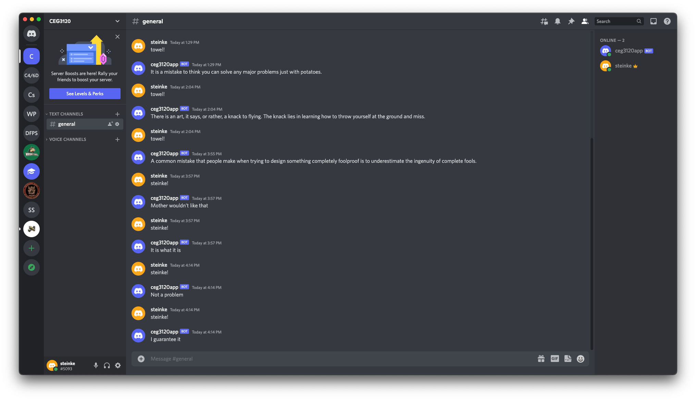

# Project 1 - Discord Bot

## Part 1 - Setup
1. How to generate an API token from Discord:
	1. create a new application on Discord Developer Portal
	2. Name the Appliaciton, agree to terms, and click create
	3. Go to Bot and click "Add Bot" then "Yes, do it!"
	4. Scroll down and be sure to have "Message Content Intent" set to on (blue)
	5. Click "Reset Token" > "Yes, do it!"
	7. Enter verification code
	8. Copy Token as you can only see this token once
2. Where to put the token:
	1. Within the folder you are runing the python code from put in a file named ".env"
	2. Within the file have the following: `DISCORD_TOKEN=REPLACE_ME_WITH_TOKEN`
	3. Add filepath to .gitignore file if uploading to github!
3. Packages needed to run the code and commands to install:
	1. Python 3.8 `sudo apt-get install python3.8`
	2. pip3 `sudo apt install python3-pip`
	3. discord.py version 2.0.1 `pip3 install -U discord.py==2.0.1`
	4. dotenv `python3.8 -m pip install python-dotenv`

## Part 2 - Usage
1. What Command can be typed in the Discord Server:
	1. `steinke!`
2. What response will be provided:
	1. `steinke!` will provide saying that are said by the Steinke family and when said, are caught by others and pointed out as they are said too often per the family. Sayings include:
	```
	1. Not a problem
	2. I guarantee it
	3. Mother wouldn't like that
	4. It is what it is
	```
	2. Photo:
	

## Part 3 - Research and Documentation
1. A possible solution would be creating a cron job where the bot.py and .env file is stored in /bin. Within crontab, we would insert the following: `@reboot python3.8 /bin/bot.py &`. This would work as when the machine is rebooted, the bot would automatically be started with the cron job. (Learned about cron jobs in previous classes with Professor Duncan and how they can be used to auto start jobs and have jobs run every day at specified times, ect.)
2. I went ahead and added this cron job to my instance on AWS and it is working as should :)
3. Source: [linuxshelltips](https://www.linuxshelltips.com/run-python-script-ubuntu-startup/#:~:text=Step%201%3A%20Create%20Your%20Python,use%20the%20following%20Python%20script.&text=Add%20the%20following%20Python%20script.&text=Upon%20rebooting%20our%20Ubuntu%20system,create%20a%20file%20called%20i_was_created.)