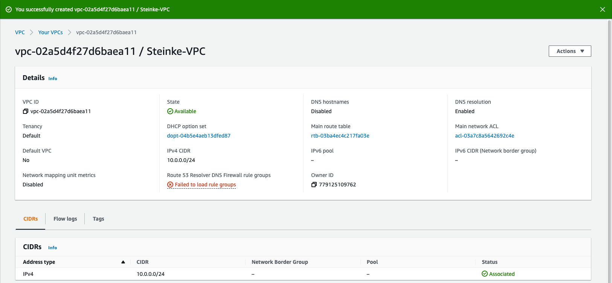
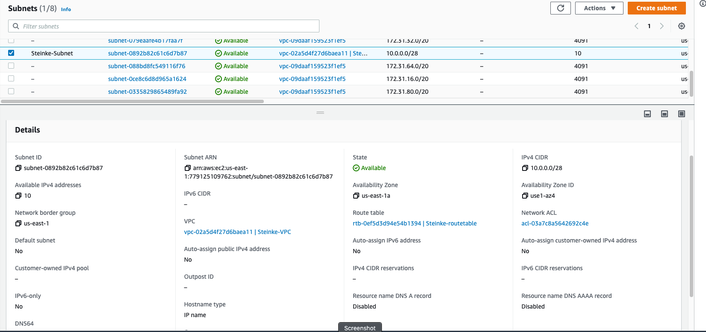
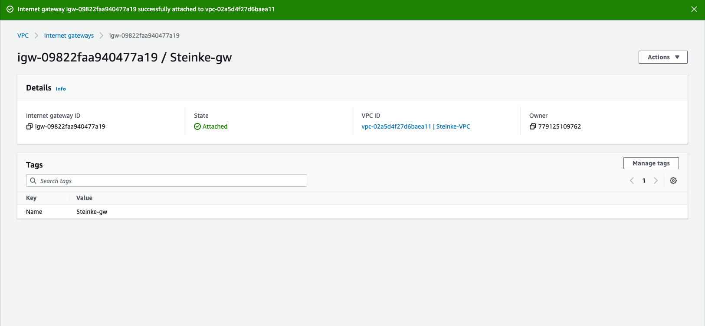
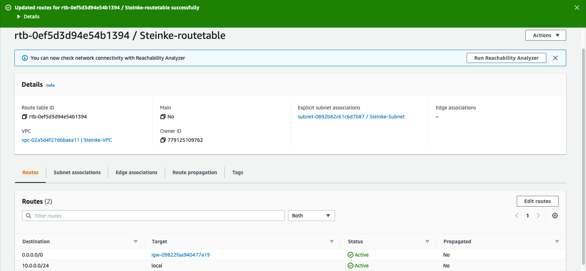
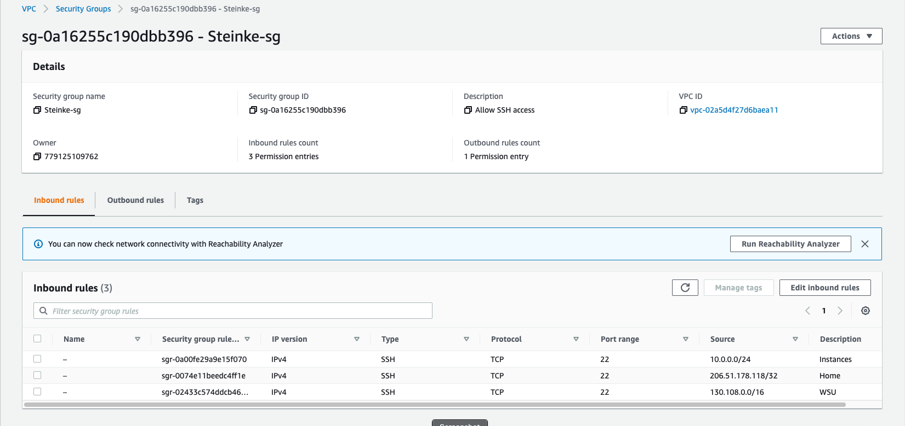
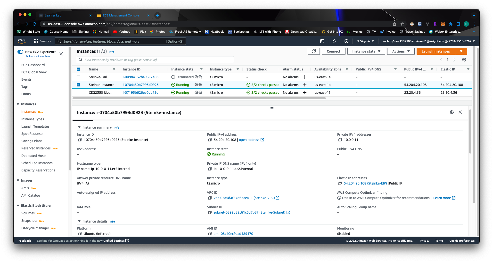
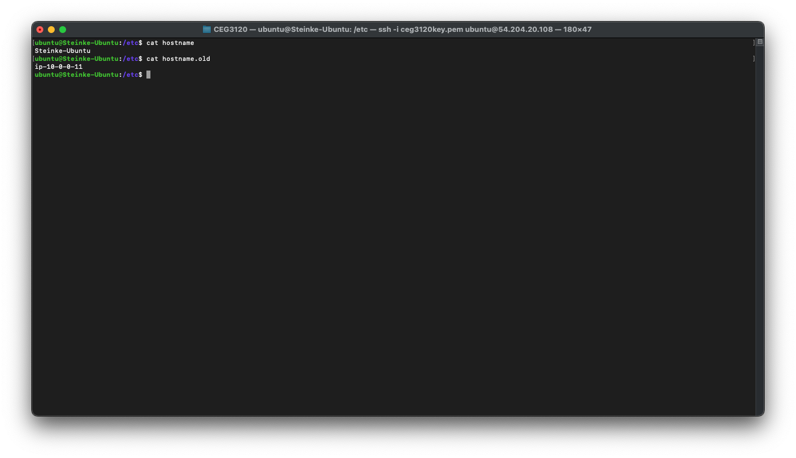

# Part 1 - Build a VPC
1. A VPC is an isolated portion of AES populated by AWS objects such as EC2 instances. It is a virtual network that resembles what a traditional network is like.  

2. A subnet is a range of IPs within a VPC, these can be connected to the internet, other VPCs and more.  

3. An internet gateway is what allows a VPC to connect to the internet. It is a "virtual router."  

4. A route table specifies how packets are forwarded between the subnets within a VPC, the internet, and a VPN connection.  

5. A security group acts as a firewall for an instance to control inbound and outbound traffic.  

# Part 2 - EC2 Instances
1. I selected Ubuntu as the AMI. The username is Ubuntu. I selected the t2.micro instance.
2. I attached the instance to the VPC when creating the instance under Network Settings and editing them to Steinke-VPC.
3. I did not have the Public IPv4 address auto-assigned as I would prefer to manually assign an IP. This way, if I "break" the instance, I can just start a new one, assosciate the same IP to it, and nothing would change from an IP stand point if it were acting as a server.
4. I had the default storage attached of 8GB when creating the instance under "Configure Storage." (Using gp2)
5. To add Name as a tag, at the top when creating the instance under "Name and tags," I added "Steinke-instance" under the Name field.
6. To associate the security group, I went under "Network settings" when creating the instance and under "Common security groups," since my VPC was selected, I could select "Steinke-sg."
7. To create and associate elastic IP I did the following: clicked Allocate Elastic IP address, added a tag of "Name" and assigned "Steinke-EIP" to it, clicked allocate, selected the EIP and clicked actions > associate elatic IP, I then selected "Steinke-instance" under Instance gave it the default Private IP address and clicked Associate.
8. 
9. To change the host name, I did a ssh connection and went into /etc and made a copy of the hostname file using `sudo cpy hostname hostname.old`. I then ran this command to change the name of the hostname: `sudo hostnamectl set-hostname Steinke-Ubuntu`
10. 