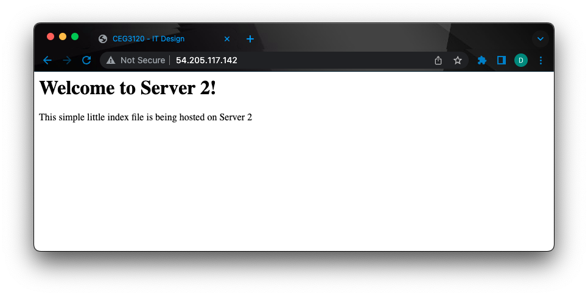

# Project 4 - Part 2
1. I went about doing the .ssh/config. With this, I created the file, and did chmod 600 on the file. The configuration for this file has the Host at the top (which is what I use after ssh to get into the instance), the Hostname (which is the private IP for the instance), and the IdentityFile (which is the private key used to get into the instance).  
Example from Webserver1 Configuration:  
```
Host proxy
	Hostname 10.0.0.10
	IdentityFile ~/.ssh/key.pey
Host Web2
	Hostname 10.0.1.11
	IdentityFile ~/.ssh/key.pem
```
2. In order to ssh into systems between each, first we need the private IPs of each instance which are as follows:
```
Proxy: 10.0.0.10
WebServer1: 10.0.1.10
Webserver2: 10.0.1.11
```
We also need to make sure taht the private key is on each system from where we want to SSH, I put mine into the ~./ssh folder as I setup a config file. Once the key is there, it needs to have chmod 600 completed.  
To SSH into an instance from there we would use the following: `ssh -i key ip` For example, if I am on the proxy and want to go to WebServer1 on my instnace I would do the following command: `ssh -i key.pem 10.0.1.10`

3. I edited only 1 file that was located at /etc/haproxy and was named haproxy.cfg.  
I made a few configuration changes including the frontend and backend by adding a bind and default_backend to the frontend and I added a balance and the servers to the backend.  
Information added: 
```
frontend haproxy_in
	bind *:80
	default_backend web_servers

backend web_servers
	balance roundrobin
	server WebServer1 10.0.1.10:80
	server WebServer2 10.0.1.11:80
```
In order to restart the service after these changes were made I ran the following command: `sudo service haproxy restart`  
I used this resource in order to figure out the configuration needed. Found [here](https://www.haproxy.com/blog/the-four-essential-sections-of-an-haproxy-configuration/).

4. On each webserver I edited only 1 file that was located at /var/www/html and was named index.html.  
This is also where the content files were located as the service uses this location by default.  
I did not change any configurations.  
I also restarted the service by using the command `sudo service apache2 restart` (just in case even though it is not needed when changing index.html).
5. Screenshots:
  
